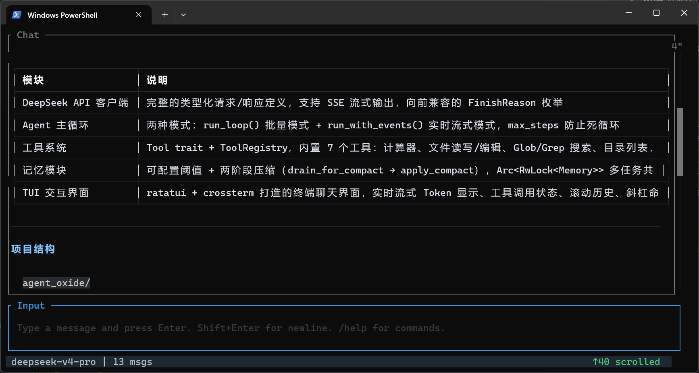

# 🦀 Loomis

<p align="center">
  
  
  
  
</p>

<p align="center">
  <em>一个基于模块化 Workspace 架构的 Rust AI 编码助手。<br>
  Tokio 异步 · Trait 工具抽象 · SSE 流式响应 · 终端交互界面 · 可复用 Crate 设计</em>
</p>

<p align="center">
  
</p>

---

## 项目简介

Loomis 是一个纯 Rust（2024 edition）编写的 **AI 编码助手**。它在终端中运行，提供完整的 TUI 聊天界面，能够在沙箱化的工作区内读写文件、用 glob 和 grep 搜索代码，并通过 SSE 协议实时流式输出模型回复——全部基于 DeepSeek API。

项目采用 **Cargo Workspace** 架构，将抽象（`provider`, `tools`, `memory`, `engine`）与实现（`deepseek`, `loomis`）分离为独立 crate，使核心组件可以在其他 Agent 项目中直接复用。

## 特性

- **模块化 Workspace 架构** — 6 个独立 crate：`provider`（LLM 抽象）、`deepseek`（DeepSeek 实现）、`tools`（工具系统）、`memory`（记忆管理）、`engine`（Agent 主循环）、`loomis`（TUI + 具体工具）
- **可插拔 LLM 提供者** — `LLMClient` trait 抽象，`DeepSeekClient` 作为参考实现，可扩展 OpenAI / Anthropic 等
- **Agent 主循环** — `run_loop()` 批量模式 + `run_with_events()` 实时流式模式，通过 `mpsc` 通道推送事件，`max_steps` 防止无限循环
- **AgentHook 生命周期** — `on_run_start`, `before_tool_call`, `after_tool_call` 等钩子，支持危险命令拦截、进度展示、UI 事件转发
- **可插拔工具系统** — `Tool` trait + `ToolRegistry`，内置计算器、Shell 命令执行、文件读写/编辑、glob 文件匹配、grep 内容搜索、ls 目录列表等工具，统一由 `WorkspaceFs` 沙箱隔离
- **对话记忆管理** — 双层压缩架构：MicroCompact（工具输出清理）在每次 API 调用前自动清除旧工具输出，保持上下文精简；LLM 摘要压缩（`drain_for_compact` → `apply_compact`）在字符预算超限时触发完整对话总结。`Arc<RwLock<Memory>>` 多任务共享，系统消息永不被压缩
- **对话持久化** — 自动保存到 `.loomis/threads/`（JSON + Markdown），多线程命名管理，`/resume` 弹窗选择器恢复历史对话，`/save <name>` 手动命名快照
- **终端交互界面** — [ratatui](https://ratatui.rs/) + [crossterm](https://crates.io/crates/crossterm) 打造，支持实时流式 Token、工具调用状态展示、滚动历史、斜杠命令、线程选择器弹窗

## 快速开始

### 前置条件

- [Rust](https://www.rust-lang.org/tools/install) 工具链（2024 edition）
- [DeepSeek API](https://platform.deepseek.com/) 密钥

### 环境配置

```bash
# 克隆仓库
git clone https://github.com/Nie-Tianyi/loomis.git
cd loomis

# 创建 .env 文件
echo 'DEEPSEEK_API=sk-your-key-here' > .env
```

### 运行

```bash
# 启动 TUI 模式（默认）
cargo run -p loomis --release

# 或使用传统命令行模式（即将迁移）
cargo run -p loomis --release -- --no-tui
```

### 测试与检查

```bash
cargo test --all           # 运行所有测试（248 个）
cargo build -p loomis      # 仅构建二进制 crate
cargo clippy --all         # 代码检查
```

## 架构详解

### Workspace 结构

```text
agent_oxide/                        # Cargo Workspace 根
├── Cargo.toml                      # [workspace] members = ["libs/*", "bins/*"]
├── libs/                           # 库 crate（抽象 + 可复用组件）
│   ├── provider/                   # LLMClient trait + Message/ToolCall/ToolDef 等共享类型
│   ├── deepseek/                   # DeepSeekClient（实现 LLMClient）+ SSE 流解析
│   ├── tools/                      # Tool trait + ToolRegistry + WorkspaceFs 沙箱
│   ├── memory/                     # Memory（内存缓冲区）+ 压缩 + 持久化
│   └── engine/                     # Agent（ReAct 循环）+ AgentHook + AgentEvent
├── bins/                           # 二进制 crate
│   └── loomis/                     # 具体工具实现 + TUI + 组装 + main.rs
└── docs/
    └── architecture.md
```

### 依赖关系图

```text
provider (无内部依赖)
    ↑
    ├── deepseek ──────── (实现 provider::LLMClient)
    ├── tools ─────────── (使用 provider::ToolDef)
    ├── memory ────────── (使用 provider::Message)
    ↑
    └── engine ────────── (使用 provider + tools + memory)
            ↑
        loomis (bin) ──── (使用全部 5 个 lib crate)
```

### Crate 职责

| Crate | 位置 | 角色 | 核心类型 |
|-------|------|------|----------|
| `provider` | `libs/` | 抽象 | `LLMClient` trait, `Message`, `Role`, `ToolCall`, `ToolDef`, `CompletionRequest`, `CompletionResponse`, `ProviderError`, `StreamChunk`, `Delta` |
| `deepseek` | `libs/` | 具体实现 | `DeepSeekClient` (impl `LLMClient`), `DeepSeekStream` (SSE 解析管道), `DeepSeekRequest`, `DeepSeekError` |
| `tools` | `libs/` | 抽象 | `Tool` trait (sync, `Send+Sync`), `ToolRegistry`, `WorkspaceFs`, `SandboxConfig`, `ToolError`, `FsError`, `generate_schema` |
| `memory` | `libs/` | 抽象 | `Memory` (内存缓冲区), `SharedMemory` (`Arc<RwLock<Memory>>`), `MemoryBuilder`, 双层压缩（MicroCompact + LLM 摘要）, `save_conversation`/`load_conversation`/`list_threads` |
| `engine` | `libs/` | 抽象 | `Agent`, `AgentEvent` (Token, ToolCall, ToolResult 等), `AgentError`, `AgentHook` trait, `EngineContext`（含压缩配置）, `maybe_compact()` |
| `loomis` | `bins/` | 二进制 + 库 | 具体工具 (CalculatorTool, ReadTool, ShellTool 等), 沙箱系统 (SandboxHook, ShellFilter, AuditLogger, ResourceTracker, EnvSanitizer), TUI (ratatui), `build_coding_agent()`, `main.rs` |

### Agent 主循环 (`libs/engine/`)

Agent 是整个框架的控制中心，对外提供两种运行模式：

| 模式 | 传输方式 | 首字节延迟 | 适用场景 |
| ---- | -------- | --------- | -------- |
| **流式**（默认） | SSE (`text/event-stream`) | ~100ms | 交互式聊天、实时 UI |
| **非流式** | JSON (`application/json`) | 完整响应时间 | 批量处理、调试 |

**运行流程**：

```text
run_loop(user_input)
  ├─ [流式]  run_streaming_loop()
  └─ [非流]  run_non_streaming_loop()
       │
       ├─ on_llm_start hooks        — 生命周期钩子：LLM 调用前
       ├─ stream_with_retry()      — 指数退避重试瞬时错误
       ├─ on_llm_end hooks          — 生命周期钩子：LLM 返回后
       │
       ├─ 有 tool_calls? → before_tool_call hooks（可拒绝执行）
       │                  → execute_all() → after_tool_call hooks
       │                  → push 结果 → 继续循环
       └─ 纯文本?       → push 到 memory → 返回
```

**关键设计决策**：

1. **`Box<dyn LLMClient>` + `#[async_trait]`** — 通过 trait object 实现提供者可插拔，无需泛型参数
2. **同步 `Tool` 执行** — `Tool` trait 是对象安全的，无需 `async_trait`。CPU 密集型工具内联执行；I/O 密集型工具可内部包装 `tokio::task::spawn_blocking`
3. **AgentHook 生命周期** — `on_run_start`, `on_llm_start`, `on_llm_end`, `before_tool_call`（可返回 Err 阻止执行）, `after_tool_call`
4. **批量锁获取** — 所有工具结果先收集到 `Vec<Message>` 中，然后在单次写锁下批量写入 memory

### SSE 流式管道 (`libs/deepseek/stream.rs`)

```text
HTTP chunk → buffer → find_event_end(\n\n) → trim_trailing_newlines
           → extract_sse_data("data: ") → [DONE]? 跳过
                                         → parse JSON → StreamChunk
                                                     ├─ content → Token
                                                     ├─ reasoning_content → ReasoningToken
                                                     └─ tool_calls → StreamAccumulator → ToolCall（流结束后发送）
```

### 工具系统 (`libs/tools/` + `bins/loomis/src/tools/`)

**层次架构**：

- **`libs/tools/`** — 抽象层：`Tool` trait, `ToolRegistry`, `WorkspaceFs`, `ToolError`, `FsError`, `generate_schema`
- **`bins/loomis/src/tools/`** — 具体实现：`CalculatorTool`, `EchoTool`, `ReadTool`, `WriteTool`, `EditTool`, `GlobTool`, `GrepTool`, `LsTool`, `ShellTool`

**Tool trait** — 同步、对象安全：

```rust
pub trait Tool: Send + Sync {
    fn name(&self) -> &str;
    fn description(&self) -> &str;
    fn parameters(&self) -> Value;
    fn execute(&self, args: &str) -> Result<String, ToolError>;
    fn to_def(&self) -> ToolDef { .. }  // 默认实现
}
```

**WorkspaceFs 沙箱** — 所有文件工具共享 `Arc<WorkspaceFs>`，路径规范化后验证不超出 `workspace_root`。同时强制执行文件大小限制、扩展名黑名单、隐藏文件保护和二进制内容检测（NULL 字节启发式）。具备 TOCTOU 二次规范化防 symlink 交换攻击。策略由 [`SandboxConfig`](libs/tools/src/sandbox/config.rs) 驱动（从 `.loomis/config.toml` 加载）。

### 沙箱系统 (`bins/loomis/src/sandbox/`)

多层纵深防御的沙箱架构：

| 层 | 组件 | 职责 |
| :-- | :--- | :--- |
| 1 | `WorkspaceFs` | 路径沙箱 — 路径规范化 + 大小/类型限制 + TOCTOU 防护 |
| 2 | `ShellFilter` | 命令分类 — auto_approve → deny_patterns → 弹出确认 |
| 3 | `SandboxHook` | 统一 AgentHook — 配额检查 → 命令分类 → 自动/拒绝/提示 |
| 4 | `EnvSanitizer` | 环境清洗 — 清空后仅恢复安全白名单变量 |
| 5 | `ResourceTracker` | 会话配额 — 操作计数 + 并发 Shell 限制 |
| 6 | `AuditLogger` | 审计追踪 — JSONL 文件记录所有操作决策 |

**配置驱动**：`.loomis/config.toml` 控制所有策略。不存文件时使用内置安全默认值。

**混合审批模式**：

- `auto_approve.prefixes` 中的命令（`git`, `cargo`, `npm`, `python` 等）→ 自动放行
- 匹配 `deny_patterns` 的命令（`rm -rf /`, `sudo`, `shutdown` 等）→ 直接拒绝
- 其他命令 → 弹出 Y/n 确认（以 TUI 内联提示呈现）

### 记忆与持久化 (`libs/memory/`)

**双层压缩架构** — 两层协同工作，在保持对话结构的同时控制上下文大小：

#### 第 1 层：MicroCompact（工具输出清理）

轻量级压缩，在每次 LLM API 调用前自动执行。将旧工具输出（read、shell、grep、glob、edit、write、ls）的内容替换为 `[Old tool result content cleared]`，同时保留最近 `keep_recent` 条输出不变。

- **零 API 成本** — 纯字符串替换，无额外 LLM 调用
- **非破坏性** — `to_compact_context_vec()` 返回压缩副本，原始 `Memory.messages` 保持不变，持久化层仍保存完整内容
- **保留结构** — tool-call / tool-result 配对关系完整保留，模型仍能理解对话流程

#### 第 2 层：LLM 摘要压缩

当对话总字符数超过 `compact_threshold`（默认 2M 字符）时触发。排出旧的非 System 消息，发送给 LLM 进行总结，将摘要作为新的 System 消息插入。

```rust
// Phase 1: 排空旧的非 System 消息
let drained = mem.drain_for_compact();
// Phase 2: LLM 生成摘要
let summary = llm.generate(summarise_prompt).await;
// Phase 3: 插入摘要
mem.apply_compact(summary);
```

- System 消息永不被排空
- 字符数阈值而非 Token 数（2M 字符 ≈ 500k–1M Token）
- 由 `Agent::maybe_compact()` 在 agent 循环中自动触发
- `EngineContext.compact_model` 设为 `None` 可禁用此层

**配置（EngineContext）**：

```rust
// 第 1 层 — MicroCompact（每次 API 调用前执行）
compact_tool_outputs: true,
keep_recent_tool_outputs: 5,
compactable_tool_names: {"read", "shell", "grep", "glob", "edit", "write", "ls"},

// 第 2 层 — LLM 摘要（超预算时触发）
compact_model: Some("deepseek-v4-flash".into()),
```

### TUI 交互界面 (`bins/loomis/src/tui/`)

ratatui + crossterm 实现的终端聊天界面。

**通道拓扑**：

```text
TUI 线程                                 Agent 任务 (tokio::spawn)
─────────                               ────────────────────────
cmd_tx ───── TuiCommand ──────────────→ cmd_rx
agent_rx ←── AgentEvent ─────────────── agent_tx
```

**键盘操作**：Enter（发送）、Ctrl+C（取消/退出）、Esc（取消）、PgUp/PgDown（滚动）、↑/↓（历史）、←/→/Home/End（光标移动）。`!<命令>` 前缀直接在 TUI 中执行 Shell 命令。

**斜杠命令**：`/exit`, `/new`, `/save <name>`, `/resume [name]`, `/threads`, `/stats`, `/tools`, `/help`。

### 与其他项目集成

Lib crate 可独立用于其他 Agent 项目：

```toml
# 仅需 LLM 抽象 + DeepSeek 客户端
[dependencies]
provider = { git = "https://github.com/Nie-Tianyi/loomis.git", branch = "master" }
deepseek = { git = "https://github.com/Nie-Tianyi/loomis.git", branch = "master" }

# 或完整 Agent 框架
engine = { git = "https://github.com/Nie-Tianyi/loomis.git", branch = "master" }
```

```rust
use deepseek::DeepSeekClient;
use engine::{Agent, EngineContext};
use memory::Memory;
use tools::ToolRegistry;

// 组装你自己的 Agent
let ctx = EngineContext {
    llm: Box::new(DeepSeekClient::new("sk-...")),
    memory: Arc::new(RwLock::new(Memory::new())),
    tools: Arc::new(my_registry),
    hooks: vec![Box::new(MyCustomHook)],
    model: "deepseek-v4-pro".into(),
    max_steps: 50,
    max_retries: 3,
    streaming: true,
};
let agent = Agent::new(ctx);
agent.run_loop("Hello!").await?;
```

## 开发路线

### 第一阶段 — MVP ✅

- [x] `libs/provider` — LLMClient trait + Message/ToolCall/ToolDef 等共享类型
- [x] `libs/deepseek` — DeepSeekClient + SSE 流解析
- [x] `libs/tools` — Tool trait + ToolRegistry + WorkspaceFs 沙箱
- [x] `libs/memory` — Memory + 两阶段压缩 + 持久化
- [x] `libs/engine` — Agent ReAct 循环 + AgentHook 生命周期 + AgentEvent 流
- [x] `bins/loomis` — 具体工具 + Hook + TUI + 组装

### 第二阶段 — 进阶

- [x] `schemars` 驱动的自动 JSON Schema 生成
- [x] 多层沙箱系统（ShellFilter + SandboxHook + AuditLogger + ResourceTracker）
- [x] 双层压缩架构（MicroCompact 工具输出清理 + LLM 摘要压缩）
- [ ] 其他 LLM 提供者实现（`libs/openai/`, `libs/anthropic/`）
- [ ] Jinja 风格提示词模板引擎
- [ ] 结构化输出

### 第三阶段 — 生产级

- [ ] RAG + 向量数据库
- [ ] `tracing` 全链路可观测性
- [ ] HTTP API + Web 客户端
- [ ] 发布 lib crate 到 crates.io

## 参与贡献

欢迎提交 Issue 和 PR！

```bash
git checkout -b feature/your-feature
cargo test --all
cargo clippy --all
# ... 提交、推送、创建 PR
```

## 许可证

MIT © 2025
